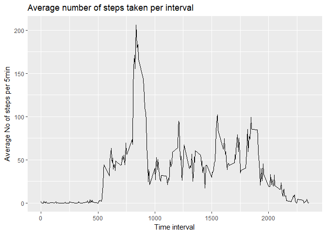
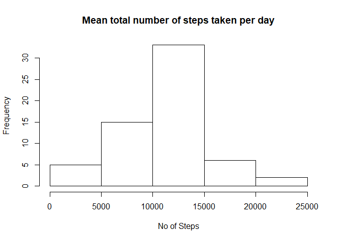
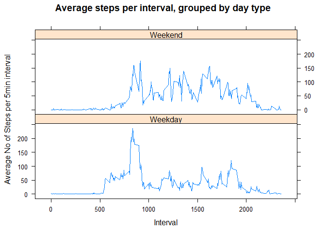

### 1.Loading and preprocessing the data


```
## Warning: package 'ggplot2' was built under R version 3.4.3
```

```
## Warning: package 'knitr' was built under R version 3.4.3
```

```
## Warning: package 'plyr' was built under R version 3.4.3
```


#### 1.1 Load the data 


```r
raw_activity <- read.csv("Course5_Project1/activity.csv")
```

#### 1.2 Process/transform the data (if necessary) into a format suitable for your analysis


```r
raw_activity$day <- weekdays(as.Date(raw_activity$date))
raw_activity$DateTime <- as.POSIXct(raw_activity$date, format="%Y-%m-%d")

clean_activity <- raw_activity[!is.na(raw_activity$steps),]
```


### 2. What is mean total number of steps taken per day?

#### 2.1 Calculate the total number of steps taken per day

```r
DailyTotal <- aggregate(clean_activity$steps ~ clean_activity$date, FUN=sum )
colnames(DailyTotal) <- c("Date","Steps")
```

#### 2.2 Make a histogram of the total number of steps taken each day
<!-- -->

#### 2.3 Calculate and report the mean and median of the total number of steps taken per day

```r
## The mean of steps
as.integer(mean(DailyTotal$Steps))
```

```
## [1] 10766
```

```r
## The median of steps
as.integer(median(DailyTotal$Steps))
```

```
## [1] 10765
```
The mean of total number of steps taken per day is 10766.

The median of total number of steps taken per day is 10765.

### 3. What is the average daily activity pattern?

#### 3.1 Make a time series plot  and the average number of steps taken, averaged across all days

<!-- -->

#### 3.2 Which 5-minute interval, on average across all the days in the dataset, contains the maximum number of steps?


```r
Max_Step_Interval <- max(Step_interval$Avg)

Step_interval[Step_interval$Avg==Max_Step_Interval,1]
```

```
## [1] 835
```

The interval at 835 had the most steps (206).


### 4. Imputing missing values

#### 4.1 Calculate and report the total number of missing values in the dataset


```r
nrow(raw_activity[is.na(raw_activity$steps),])
```

```
## [1] 2304
```
There are 2304 rows with missing values.

#### 4.2 Devise a strategy for filling in all of the missing values in the dataset. 

My strategy will be straightforward. Calculate the average 5-minute interval for a given weekday, and use that imputed value for missing rows.


```r
avg_activity <- ddply(clean_activity, .(interval,day), summarize, Avg = mean(steps))

only_na_activity <- raw_activity[is.na(raw_activity$steps),]
```

#### 4.3 Create a new dataset that is equal to the original dataset but with the missing data filled in.


```r
## Create a dataset with the imputed fills. Group by interval and day
merged_data <- merge(only_na_activity,avg_activity, by=c("interval","day"))

## Reorganise rows and name them appropriately
merged_data_sorted <- merged_data[,c(6,4,1,2,5)]
colnames(merged_data_sorted) <- c("steps","date","interval", "day", "DateTime")

## Merge together with parent dataset
merged_imputed_clean_activity <-rbind(clean_activity,merged_data_sorted)
```
#### 4.4 Calculate and report the mean and median total number of steps taken per day


```r
DailyTotal2 <- aggregate(merged_imputed_clean_activity$steps ~ merged_imputed_clean_activity$date, FUN=sum)
colnames(DailyTotal2) <- c("Date","Steps")


## The mean of steps
as.integer(mean(DailyTotal2$Steps))
```

```
## [1] 10821
```

```r
## The median of steps
as.integer(median(DailyTotal2$Steps))
```

```
## [1] 11015
```

The new mean of total number of steps taken per day is 10821.

The new median of total number of steps taken per day is 11015.


#### 4.5 Make a histogram of the total number of steps taken each
<!-- -->

#### 4.6 Do these values differ from the estimates from the first part of the assignment? What is the impact of imputing missing data on the estimates of the total daily number of steps?

The values do differ slightly from the first part of the assignment. The new mean is 10821, 55 steps more than the old mean. The new median is 11015, 250 steps more than the previous.

However, the distribution stays very similar, as is apparent from the two histograms.


### 5. Are there differences in activity patterns between weekdays and weekends?


#### 5.1 Create a new factor variable in the dataset with two levels - "weekday" and "weekend" indicating whether a given date is a weekday or weekend day.


```r
merged_imputed_clean_activity$DayType <- ifelse(merged_imputed_clean_activity$day %in% c("Saturday", "Sunday"), "Weekend", "Weekday")
```

#### 5.2. Make a panel plot containing a time series plot of the 5-minute interval (x-axis) and the average number of steps taken, averaged across all weekday days or weekend days (y-axis).


```r
## Echoing this production as it's a bit more complicated

Step_interval2 <- ddply(merged_imputed_clean_activity, .(interval, DayType), summarize, Avg = mean(steps))

xyplot(Avg~interval|DayType, data=Step_interval2, type="l", layout = c(1,2),
       ylab="Average No of Steps per 5min interval",
       xlab="Interval",
       main="Average steps per interval, grouped by day type")
```

<!-- -->

There are clear differences between the weekends and weekdays.

